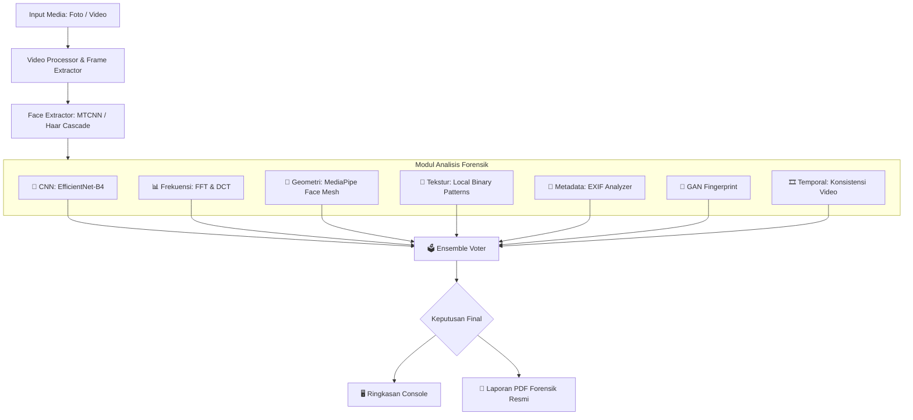

# 🛡️ DEFORAG — Sistem Forensik Deteksi Deepfake

[](https://www.python.org/)
[](https://pytorch.org/)
[](https://mediapipe.dev/)
[](https://opensource.org/licenses/MIT)

**DEFORAG** (Digital Forensic & Deepfake Detection Engine) adalah sistem analisis forensik digital tingkat lanjut yang dikembangkan oleh **ANTENK TEAM** untuk mendeteksi manipulasi wajah dan rekayasa kecerdasan buatan (*deepfake*) pada berkas foto maupun video.

Sistem ini menggabungkan model *deep learning* (CNN) berkinerja tinggi dengan analisis statistik sinyal (domain frekuensi), deteksi inkonsistensi geometri (landmark wajah), serta metadata forensik untuk menghasilkan akurasi deteksi yang sangat andal (**AUC: 98.56%**).

---

## 🚀 Alur Kerja Sistem



---

## ✨ Fitur Utama

1. **Analisis Ensemble Multi-Modul**: Menggabungkan hasil analisis dari berbagai aspek (visual, spektral, spasial, temporal, dan metadata) menggunakan bobot kontribusi yang dioptimalkan untuk mengurangi tingkat kesalahan *false positive*.
2. **Deep Learning Classifier (CNN)**: Didukung arsitektur **EfficientNet-B4** yang dilatih secara khusus untuk membedakan wajah asli dari hasil generasi *deepfake* berbasis AI generative terkini.
3. **Deteksi Spektral Frekuensi (FFT & DCT)**: Mengidentifikasi artefak periodik dan anomali spektrum frekuensi tinggi yang sering ditinggalkan oleh generator gambar AI (GAN/Diffusion).
4. **Deteksi Inkonsistensi Geometri Landmark**: Memanfaatkan **MediaPipe Face Landmarker (478 landmark)** untuk menganalisis simetri wajah, rasio proporsi, dan gerakan kedipan mata yang tidak natural.
5. **Generator Laporan PDF Forensik**: Menghasilkan dokumen laporan analisis forensik PDF resmi berbahasa Indonesia dengan nomor laporan unik, statistik visual, dan penjelasan teknis yang siap digunakan untuk kebutuhan dokumentasi.

---

## 📁 Struktur Proyek

```text
deforag/
├── deforag.py             # CLI Interface utama aplikasi
├── install.py             # Script instalasi dependensi otomatis (Windows-compatible)
├── requirements.txt       # Daftar pustaka Python yang dibutuhkan
├── README.md              # Dokumentasi proyek
├── LICENSE                # Lisensi proyek (MIT License)
│
├── deforag/               # Source code utama aplikasi
│   ├── modules/           # Modul-modul analisis forensik (CNN, FFT, Landmark, dll)
│   └── utils/             # Modul utilitas pendukung (Face Extractor, Video Processor, Visualizer)
│
├── ensemble/              # Mekanisme voting/penggabungan keputusan analisis
├── models/                # Folder penyimpanan berkas bobot model (*.pth)
├── foto_dan_video/        # Sampel media uji coba (foto & video)
└── hasil forensik/        # Folder output hasil pembuatan dokumen laporan PDF
```

---

## 🛠️ Instalasi & Persiapan

### 1. Kloning Repositori
```bash
git clone https://github.com/rizkyfy/DEFORAG.git
cd deforag
```

### 2. Instal Dependensi
Jalankan script instalasi otomatis untuk menyiapkan *virtual environment* dan mengunduh seluruh dependensi yang diperlukan:
```bash
python install.py
```

### 3. Siapkan Model Weights
Unduh berkas bobot model `deforag_final.pth` (74.6 MB) lalu letakkan berkas tersebut di dalam folder `models/`:
```text
deforag/
└── models/
    ├── deforag_final.pth
    └── model_config.json
```

---

## 💻 Penggunaan CLI (Command Line Interface)

Aplikasi dijalankan melalui file `deforag.py` dengan parameter sebagai berikut:

### Analisis Cepat Gambar/Foto
```bash
python deforag.py --input foto_dan_video/fake.PNG
```

### Analisis Video dengan Pembuatan Laporan PDF
```bash
python deforag.py --input foto_dan_video/deepfake_video.mp4 --report
```

### Analisis Gambar & Menyimpan PDF ke Folder Kustom
```bash
python deforag.py --input foto_dan_video/real_bowo.jpg --report --output ./hasil_analisis
```

### Mode Detail (Verbose)
```bash
python deforag.py --input foto_dan_video/fake.PNG --verbose
```

---

## 📊 Detail Parameter CLI

| Parameter | Singkatan | Deskripsi | Default |
| :--- | :--- | :--- | :--- |
| `--input` | `-i` | **(Wajib)** Path ke gambar atau video yang akan dianalisis | - |
| `--report` | `-r` | Jika disertakan, sistem akan membuat dokumen laporan PDF resmi | `False` |
| `--output` | `-o` | Direktori tempat menyimpan laporan PDF hasil analisis | `.` |
| `--verbose` | `-v` | Menampilkan log analisis detail per frame/modul ke konsol | `False` |
| `--no-color`| - | Menghilangkan format warna ANSI pada teks konsol | `False` |

---

## ⚖️ Lisensi
Proyek ini dilisensikan di bawah **MIT License** - lihat berkas [LICENSE](LICENSE) untuk detail lebih lanjut.

Developed with ❤️ by **ANTENK TEAM** - 2026
